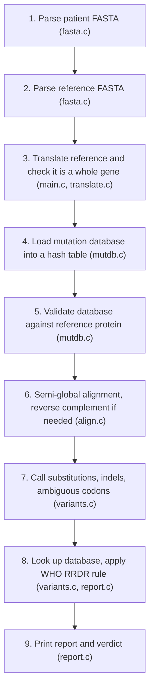

# rpoB Rifampicin Resistance Scanner

#### Video Demo: <URL HERE>

#### Author: **kewanessa**
Harvard CS50x Final Project

#### Description:

The **rpoB Rifampicin Resistance Scanner** (`amr_scan`) is a command-line bioinformatics tool written in C. It detects and interprets antimicrobial resistance (AMR) mutations in the *Mycobacterium tuberculosis* *rpoB* gene, which encodes the β-subunit of bacterial RNA polymerase.

Rifampicin is one of the most potent first-line antibiotics used to treat tuberculosis. It binds a pocket of the RNA polymerase β-subunit next to the catalytic centre and blocks the growing RNA chain. In *M. tuberculosis*, most rifampicin resistance (about 95% in the literature) is caused by mutations in an 81-base-pair "hotspot" called the **Rifampicin Resistance-Determining Region (RRDR)**, codons 426 to 452 (*M. tuberculosis* numbering). Because rifampicin resistance is the main marker of multidrug-resistant tuberculosis (MDR-TB), detecting it quickly matters for choosing treatment.

The program follows the same logic as molecular tests such as GeneXpert MTB/RIF and whole-genome sequencing pipelines, in a small, self-contained C program. It aligns a patient sequence to the reference gene, translates codons, finds substitutions, insertions and deletions, looks them up in a mutation table built from the **WHO 2023 mutation catalogue**, and prints a structured report that ends in an interpretive verdict (for research and education only).

---

## What It Does

Given a patient FASTA file (a full-length 3,519 bp *rpoB* sequence or a short PCR amplicon covering the RRDR, from either DNA strand), a reference FASTA file and a tab-separated mutation database, `amr_scan` runs a 9-step pipeline:



1. **FASTA parsing**: reads sequences of any line length, with Unix, Windows or old Mac line endings, a UTF-8 byte order mark, lowercase letters and IUPAC ambiguity codes.
2. **Reference check**: translates the reference into its 1,172-amino-acid protein (reading the bacterial `TTG` start codon as Met) and stops if the reference is not a complete gene, because codon numbers would then be wrong.
3. **Database loading and self-validation**: loads `mutations.tsv` into a hash table and checks every entry's reference amino acid against the reference protein. Any mismatch (for example, *E. coli* numbering) stops the program with an error.
4. **Semi-global alignment**: Needleman-Wunsch dynamic programming with free end gaps, so an amplicon can sit anywhere along the gene. If the sample aligns poorly, the program tries its reverse complement (a read from the other strand).
5. **Variant calling**: maps the patient onto reference codons and finds synonymous and non-synonymous substitutions, in-frame and frameshift insertions and deletions, and codons with ambiguous base calls.
6. **Report and verdict**: sorts every variant into one category, checks that the RRDR was fully read, and prints a verdict.

---

## The Biology and Numbering Systems

### The RRDR Hotspot
Codons 426 to 452 of *rpoB* form the rifampicin binding pocket. The most common resistance mutation worldwide is **S450L** (TCG → TTG, Ser450Leu), followed by changes at codon **H445** (e.g. H445Y, H445D) and codon **D435** (e.g. D435V). Two WHO group 1 mutations lie **outside** the RRDR: **V170F** and **I491F**. Both are in the database, so they are detected when the sequence covers them.

### Numbering Discrepancies
Older literature numbers *rpoB* mutations by the *Escherichia coli* gene instead of *M. tuberculosis*:
- *M. tuberculosis* **S450L** = *E. coli* **S531L** (+81)
- *M. tuberculosis* **H445Y** = *E. coli* **H526Y** (+81)
- *M. tuberculosis* **D435V** = *E. coli* **D516V** (+81)

`amr_scan` uses *M. tuberculosis* H37Rv numbering throughout. The database self-check refuses a database written in the wrong numbering.

---

## Command-Line Usage

```bash
./amr_scan <patient.fasta> <reference.fasta> <mutations.tsv>
./amr_scan -h | --help
./amr_scan -v | --version
```

- `patient.fasta`: DNA from a patient isolate (full gene or RRDR amplicon, either strand). Only the first record of the file is analysed; the program prints a note if there are more.
- `reference.fasta`: the *M. tuberculosis* H37Rv *rpoB* gene (NCBI `NC_000962.3:759807-763325`, 3,519 bp).
- `mutations.tsv`: tab-separated database of resistance mutations.

The program exits with code 0 when it produces a report and code 1 on any error (missing or invalid file, bad database, wrong reference).

### Example Commands

```bash
# Scan a patient sample with the S450L mutation
./amr_scan tests/test_S450L.fasta "ncbi data/ncbi_dataset/data/gene.fna" mutations.tsv

# Scan a 200 bp RRDR amplicon
./amr_scan tests/test_rrdr_fragment.fasta "ncbi data/ncbi_dataset/data/gene.fna" mutations.tsv

# A read from the opposite DNA strand is detected automatically
./amr_scan tests/test_revcomp_S450L.fasta "ncbi data/ncbi_dataset/data/gene.fna" mutations.tsv
```

### Example Report (S450L)

```
  Sample:         patient_S450L
  Strand:         forward
  Identity:       99.97%
  Aligned:        3519 of 3519 patient bases
  Sequenced Span: bp 1 - 3519
  RRDR Coverage:  Complete (81/81 bp)

--- KNOWN RESISTANCE-ASSOCIATED MUTATIONS ---
  * S450L (TCG -> TTG, c.1349C>T) - Associated with resistance
    Source: WHO 2023
...
  VERDICT: RIFAMPICIN RESISTANCE-ASSOCIATED MUTATION DETECTED
```

---

## Building and Testing

The `Makefile` uses strict compiler flags (`-Wall -Wextra -Werror -std=c11 -O2`).

```bash
make            # Build the program (amr_scan)
make test       # Run the 32-test suite
make asan       # Build amr_scan_asan with AddressSanitizer + UndefinedBehaviorSanitizer and run all tests on it
make valgrind   # Check for memory leaks with Valgrind
make clean      # Remove compiled files
```

---

## Files and Design Decisions

### [`main.c`](main.c) — Pipeline
- **Role**: parses the command line, runs each module in order, and frees every allocation before exiting.
- **Design decisions**:
  - If any step fails, the memory already allocated is freed and the program exits with code 1.
  - *Reference check*: the reference must be a whole gene (start codon, stop codon at the end, no stop codon in between). The RRDR is defined by codon numbers, so a reference with extra flanking DNA would silently shift every codon.
  - *Database mismatch is fatal*: if any database entry disagrees with the reference protein, the program stops instead of risking a false "no resistance" result.
  - *Strand detection*: an alignment is trusted only if identity is at least 90% over at least 100 bases (or half of a shorter sequence). Otherwise the reverse complement is tried, and if neither aligns well the verdict is "INCONCLUSIVE".

### [`fasta.c`](fasta.c) / [`fasta.h`](fasta.h) — Sequence Parser
- **Role**: reads the first FASTA record into a `FastaRecord` (`id`, `sequence`, `length`), and provides `reverse_complement`.
- **Design decisions**:
  - *Character-by-character reading (`fgetc`)*: lines can be of any length, and line and column numbers are known for error messages.
  - *Growing buffer (`realloc`)*: the sequence buffer starts at 1,024 bytes and doubles when full (the CS50 week 5 resizable-array idea).
  - *Validation*: letters are uppercased; only A, C, G, T and IUPAC ambiguity codes (N, R, Y, S, W, K, M, B, D, H, V) are accepted. Anything else stops with an error such as `invalid character '1' on line 2, column 5`.
  - *Portability*: handles `\n`, `\r\n` and `\r` line endings and skips a UTF-8 byte order mark. If there is no header, the file's base name becomes the sample ID.

### [`align.c`](align.c) / [`align.h`](align.h) — Semi-Global Needleman-Wunsch Alignment
- **Role**: finds the best alignment between the patient sequence and the reference.
- **Design decisions**:
  - *Free end gaps*: a normal global alignment would punish a 200 bp amplicon with thousands of end-gap penalties. The first row and column of the score matrix are zero and the best end cell is searched in the last row and column, so leading and trailing gaps in either sequence are free. Primers or flanking DNA beyond the gene ends are ignored.
  - *Heap memory*: a 3,519 × 3,519 matrix has about 12.4 million cells, too big for the stack. Scores and traceback directions are stored in flat arrays on the heap (`score[i * cols + j]`) with `size_t` indexes. A size limit (50 million cells) rejects absurdly long inputs with a clear error.
  - *Scoring*: +1 match, −1 mismatch, −2 per gap base (linear gap penalty).
  - *Contiguous indels*: with a linear gap penalty, a 3 bp deletion scores the same as a 1 bp plus a 2 bp deletion. The traceback matrix stores **every** optimal direction per cell as bit flags, and the traceback keeps extending a gap that is already open whenever that is still optimal. Without this, an in-frame codon deletion was reported as two frameshifts. Other ties are broken Diagonal > Up > Left, which places an indel inside a repeat at its left-most position (like `bcftools norm`).

### [`translate.c`](translate.c) / [`translate.h`](translate.h) — Codon Translation
- **Role**: translates three-base codons into one-letter amino acid codes.
- **Design decisions**:
  - *64-entry lookup table*: maps A=0, C=1, G=2, T=3 to the index `b1 * 16 + b2 * 4 + b3` instead of a long `switch`.
  - *Bacterial start codons*: `GTG` and `TTG` are read as Met at codon 1. The H37Rv *rpoB* gene starts with `TTG`, so this prevents a false "L1M" call.
  - Codons with gaps or ambiguity codes translate to `'?'`.

### [`variants.c`](variants.c) / [`variants.h`](variants.h) — Variant Calling
- **Role**: walks the alignment, projects patient bases onto reference coordinates and lists every difference.
- **Design decisions**:
  - *Aligned window*: only the stretch between the first and last patient bases that sit on reference bases is analysed. Unsequenced reference and overhanging flanks are not variants.
  - *Variant types*: `VAR_SNP` (one or more changed bases in one codon), `VAR_INSERTION`, `VAR_DELETION` (with a frameshift flag when the length is not a multiple of 3) and `VAR_AMBIGUOUS` (a codon containing N or a mixed base call such as Y = C/T).
  - *RRDR flag*: a variant is in the RRDR if any codon it touches is in codons 426–452, so deletions crossing the boundary are not missed.
  - *Database lookup*: each amino acid change is looked up by codon and new amino acid; the entry must also match the reference amino acid. Variants are sorted by position.

### [`mutdb.c`](mutdb.c) / [`mutdb.h`](mutdb.h) — Mutation Database Hash Table
- **Role**: loads the mutation table and answers lookups in O(1) average time.
- **Design decisions**:
  - *Hash table with chaining*: 211 buckets (a prime), hash `(codon * 31 + alt_aa) % 211` computed in unsigned arithmetic, collisions kept in linked lists.
  - *Strict parsing*: each line is split on tabs (empty fields are kept) and numbers are read with `strtol`. Rows that are malformed, not *rpoB*, use 3-letter amino acids, have a confidence outside 1–5, or repeat an existing mutation are skipped with a warning. A database with no valid rows is an error, since it would make every sample look susceptible.
  - *Five confidence groups*, matching WHO 2023: 1 Associated with resistance, 2 Associated with resistance (interim), 3 Uncertain significance, 4 Not associated (interim), 5 Not associated.
  - *Self-validation*: `validate_mutdb` checks `ref_aa` against `ref_protein[codon - 1]` for every entry.

### [`report.c`](report.c) / [`report.h`](report.h) — Report and Verdict
- **Role**: prints sample information, identity, aligned bases, sequenced span, RRDR coverage, the variants by category, a summary and the verdict.
- **Design decisions**:
  - *Categories* (each variant appears in exactly one, so the summary adds up):
    1. **Known resistance-associated**: a WHO group 1–2 database entry, **or** any other amino acid change or in-frame indel inside the RRDR. The second part follows the WHO 2023 "additional grading rule": *any non-silent RRDR mutation is assumed to confer rifampicin resistance in the absence of evidence to the contrary* (WHO 2023, Table 1 and section 3.2). The report marks these as "WHO 2023 additional grading rule".
    2. **Uncharacterized RRDR variants**: nonsense and frameshift changes in the RRDR. *rpoB* is essential, so these usually indicate a sequencing error.
    3. **Other non-synonymous variants** outside the RRDR.
    4. **Synonymous changes**.
    5. **Ambiguous codons** (N or mixed base calls).
  - *Verdict* (the first rule that applies wins):
    1. Poor alignment → `INCONCLUSIVE - sample does not align well to the rpoB reference`
    2. Any category 1 variant → `RIFAMPICIN RESISTANCE-ASSOCIATED MUTATION DETECTED`
    3. Any category 2 variant → `UNCHARACTERIZED RRDR VARIANT - phenotypic testing advised`
    4. Any RRDR base missing or ambiguous → `INCONCLUSIVE - RRDR not fully covered or contains ambiguous bases`
    5. Otherwise → `No known resistance mutation detected in RRDR`
  - *Mixed base calls are not ignored*: a Y (C/T) at S450 could hide S450L, so an ambiguous RRDR base makes the result inconclusive instead of negative.
  - *QC warning* for frameshifts and premature stop codons.
  - *Disclaimer*: research and educational use only; a negative result does not rule out resistance (mutations outside the sequenced region, minority populations and non-*rpoB* mechanisms are not detected).
  - DNA changes are printed in c. notation (position in the gene), e.g. `c.1349C>T`.

### [`tools/extract_who_rpoB.py`](tools/extract_who_rpoB.py) — Database Builder
Rebuilds `mutations.tsv` from the official WHO catalogue Excel file using only the Python standard library, so anyone can check where every row came from (see below).

---

## Data Sources and Provenance

### 1. Reference DNA and Protein (`ncbi data/`)
- **Source**: NCBI Datasets, *Mycobacterium tuberculosis* H37Rv (Taxonomy ID `83332`), assembly ASM19595v2 (`GCF_000195955.2`), chromosome `NC_000962.3`.
- **Gene**: *rpoB*, NCBI Gene ID `888164`, locus tag `Rv0667`, coordinates `NC_000962.3:759807-763325` (plus strand, 3,519 bp).
- **Protein**: `NP_215181.1`, DNA-directed RNA polymerase subunit β (1,172 amino acids).
- **Files**: `gene.fna` (gene sequence), `protein.faa` (protein), `data_report.jsonl` (metadata), `md5sum.txt` (checksums).

### 2. Mutation Database (`mutations.tsv`)
- **Source**: World Health Organization. *Catalogue of mutations in Mycobacterium tuberculosis complex and their association with drug resistance, second edition.* Geneva: WHO; 2023. ISBN 978-92-4-008241-0.
- **File used**: `WHO-UCN-TB-2023.7-eng.xlsx`, sheet `Catalogue_master_file`, from the official repository <https://github.com/GTB-tbsequencing/mutation-catalogue-2023> (data licence: ODC-By 1.0).
- **Filter**: drug = Rifampicin, gene = *rpoB*, effect = missense variant, final grading group 1 or 2. Result: **103 mutations** (23 in group 1, 80 in group 2), including V170F and I491F outside the RRDR.
- **Reproduce**: `python3 tools/extract_who_rpoB.py WHO-UCN-TB-2023.7-eng.xlsx > mutations.tsv`
- **Source column**: `WHO 2023`, plus `borderline` for WHO "borderline" mutations and `RRDR rule` for mutations graded by WHO's RRDR additional grading criterion.
- **Not in the table**: WHO-graded in-frame insertions and deletions (e.g. p.Asp435del, p.Phe433dup) are not single-codon substitutions. The program covers them with the RRDR rule instead (every one of them in the catalogue is group 1 or 2).
- **Verification**: every reference amino acid was checked against `NP_215181.1`, and the program re-checks them every time it runs.

---

## The Automated Test Suite

[`tests/run_tests.sh`](tests/run_tests.sh) runs 32 tests. Each test checks the exit code, the exact verdict line and, where relevant, specific report lines (variant name, c. position, span, coverage). Under `make asan` any sanitizer message fails the test.

| # | Test file | Input | Expected result |
|---|-----------|-------|-----------------|
| 1 | `test_wildtype.fasta` | Full-length H37Rv gene | No known resistance mutation, 0 variants |
| 2 | `test_S450L.fasta` | c.1349C>T (TCG→TTG) | Resistance: S450L |
| 3 | `test_H445Y.fasta` | c.1333C>T (CAC→TAC) | Resistance: H445Y |
| 4 | `test_D435V.fasta` | c.1304A>T (GAC→GTC) | Resistance: D435V |
| 5 | `test_D435F.fasta` | Two bases changed, GAC→TTC | Resistance: D435F |
| 6 | `test_double.fasta` | S450L + H445Y | Resistance: both listed |
| 7 | `test_I491F.fasta` | c.1471A>T, outside RRDR | Resistance: I491F (outside RRDR, borderline) |
| 8 | `test_deletion.fasta` | 3 bp deletion c.1303_1305delGAC (p.Asp435del) | Resistance by WHO RRDR rule, one in-frame deletion |
| 9 | `test_insertion.fasta` | 3 bp insertion c.1302_1303insGCC | Resistance by WHO RRDR rule, one in-frame insertion |
| 10 | `test_fragment_S450L.fasta` | 200 bp amplicon (c.1201–1400) with S450L | Resistance, span bp 1201–1400 |
| 11 | `test_revcomp_S450L.fasta` | S450L sample on the opposite strand | Resistance, strand auto-detected |
| 12 | `test_lowercase_crlf.fasta` | Lowercase, CRLF line endings, no header | Resistance: S450L |
| 13 | `test_synonymous.fasta` | c.600G>T, silent, codon 200 | No known resistance mutation |
| 14 | `test_rrdr_silent.fasta` | c.1299C>T, silent, codon 433 (in RRDR) | No known resistance mutation |
| 15 | `test_rrdr_fragment.fasta` | 200 bp wild-type amplicon | No known resistance mutation, RRDR complete |
| 16 | `test_flanks.fasta` | Gene plus 30 bp and 20 bp of flanking DNA | No known resistance mutation, no false insertions |
| 17 | `test_nonsense.fasta` | S450* (TCG→TAG) | Uncharacterized RRDR variant, QC warning |
| 18 | `test_frameshift.fasta` | 1 bp deletion c.1341delC | Uncharacterized RRDR variant |
| 19 | `test_rrdr_ns.fasta` | NNN at codon 440 | Inconclusive (78/81 bp) |
| 20 | `test_hetero_S450.fasta` | Mixed base Y (C/T) at c.1349 | Inconclusive (could hide S450L) |
| 21 | `test_no_rrdr.fasta` | First 600 bp only | Inconclusive (0/81 bp) |
| 22 | `test_unrelated.fasta` | 600 bp of random DNA | Inconclusive, poor alignment |
| 23 | `test_all_n.fasta` | 200 Ns | Inconclusive, poor alignment |
| 24 | `test_empty.fasta` | Empty file | Error, exit code 1 |
| 25 | `test_malformed.fasta` | Invalid characters | Error naming line 2, column 5 |
| 26 | (missing file) | File does not exist | Error, exit code 1 |
| 27 | (one argument) | Wrong number of arguments | Usage message, exit code 1 |
| 28 | `db_empty.tsv` | Database with no rows | Error, exit code 1 |
| 29 | `db_ecoli_numbering.tsv` | S450L written as E. coli S531L | Numbering mismatch error |
| 30 | (amplicon as reference) | Reference that is not a whole gene | Error, exit code 1 |
| 31 | `--help` | Help flag | Usage, exit code 0 |
| 32 | `--version` | Version flag | Version, exit code 0 |

All 32 tests pass with the normal build, under AddressSanitizer/UndefinedBehaviorSanitizer (`make asan`), and Valgrind reports no leaks.

---

## Limitations

1. **Consensus sequences only**: the tool reads one consensus FASTA sequence. It does not process raw FASTQ reads or measure allele frequencies, so low-level heteroresistance is only noticed when the consensus has a mixed base call.
2. **One gene**: only *rpoB* (rifampicin). Full susceptibility testing also needs *katG*/*inhA* (isoniazid), *gyrA*/*gyrB* (fluoroquinolones), *rrs*/*eis* (aminoglycosides) and others.
3. **Indels by rule, not by table**: in-frame indels are classified with the WHO RRDR rule, so WHO group 1 indels (e.g. p.Phe433dup) are labelled "interim" rather than group 1. Indel positions are left-aligned, while WHO protein names use the right-most (3′) position.
4. **Linear gap penalties**: the aligner uses linear gaps (−2 per base). Affine gap penalties would model long indels better.
5. **Not a medical device**: this software is for academic, educational and research use. It is not an FDA- or CE-IVD-cleared diagnostic.

---

## License

This software is released under the **MIT License** (see [`LICENSE`](LICENSE)). The MIT License lets students, researchers and clinicians study and build on the code, and states that the software is provided "as is", without warranty, which matters for biomedical software. The WHO catalogue data in `mutations.tsv` is used under ODC-By 1.0 with attribution above.

---

## Acknowledgements and AI Assistance

In line with CS50's academic honesty policy for final projects, I disclose that AI-based software (Anthropic's Claude, used through Claude Code) helped during the final review of this project. It was used to review the code for bugs; to help fix the problems found (indels split into frameshifts by the alignment traceback, ambiguous bases in the RRDR, flanking DNA reported as insertions, an out-of-bounds read, database validation and parsing); to rebuild `mutations.tsv` from the official WHO 2023 catalogue with `tools/extract_who_rpoB.py`; to extend the test suite; and to revise this README. Source files touched by this work carry an "AI assistance" comment in their header.

---

## References

1. World Health Organization. *Catalogue of mutations in Mycobacterium tuberculosis complex and their association with drug resistance, second edition.* Geneva: World Health Organization; 2023. ISBN 978-92-4-008241-0.
2. Miotto P, Tessema B, Tagliani E, et al. *A standardised method for interpreting the association between mutations and phenotypic drug resistance in Mycobacterium tuberculosis.* European Respiratory Journal. 2017;50(6):1701354. doi:10.1183/13993003.01354-2017.
3. Needleman SB, Wunsch CD. *A general method applicable to the search for similarities in the amino acid sequence of two proteins.* Journal of Molecular Biology. 1970;48(3):443-453.
4. Cole ST, Brosch R, Parkhill J, et al. *Deciphering the biology of Mycobacterium tuberculosis from the complete genome sequence.* Nature. 1998;393(6685):537-544. doi:10.1038/31159.
